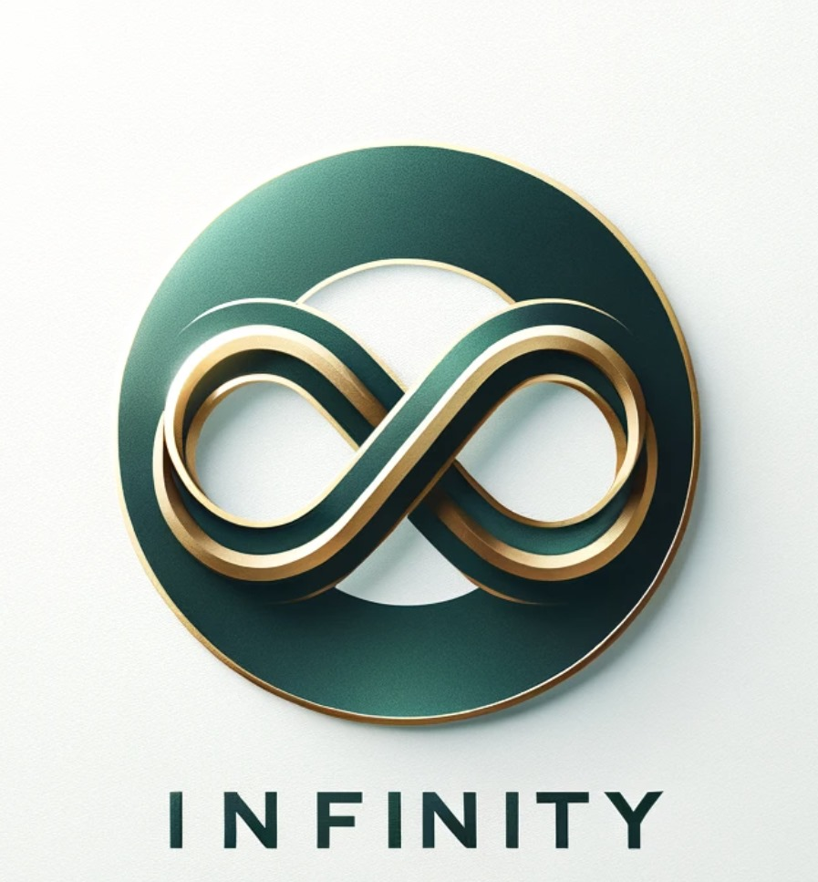

# Infinity - Digital Immortality

**Infinity - Digital Immortality** offers a transformative partnership for esteemed watchmakers, designed to disrupt the traditional watch market by merging the timeless symbol of a watch with the enduring concept of digital immortality. This luxury watch, enhanced with advanced AI technology, captures personal narratives and transforms them into sophisticated digital avatars, embodying the essence of the wearer and ensuring their legacy continues indefinitely.

Emphasizing that both watches and immortality represent timeless values, this partnership redefines the significance of a timepiece—not just as an indicator of time but as a key to eternal life. By integrating cutting-edge digital preservation technology, we position our partner brands to lead a shift in the luxury watch market, where each watch extends beyond its conventional role to become a perpetual repository of personal history. This innovative approach promises to redefine the industry, aligning the ageless elegance of watches with the timeless nature of digital existence.

## Our Goal

Our goal is to create digital infinity. At the moment, we are kickstarting our project as part of the Venture Lab of IE University. Since this project is ambitious, we plan to apply to Y-Combinator. If you are looking forward to working on a disruptive but also crazy venture with two young entrepreneurs - feel free to reach out.

## Contact & Follow Us

Our team merges business and technical expertise. Leon, our CEO, is pursuing his business degree at IE University, and Yanick, our CTO, has just finished his Bachelor's at ETH Zurich with Distinction. Reach out to us via our [LinkedIn Leon](https://www.linkedin.com/search/results/all/?fetchDeterministicClustersOnly=true&heroEntityKey=urn%3Ali%3Afsd_profile%3AACoAAD1W9jEByjmBPGzJ1zAoAZp0qlX9O_QGomc&keywords=leon%20niederberger&origin=RICH_QUERY_SUGGESTION&position=0&searchId=2ca6f06a-2c0e-464f-92cd-c0175bb95ffa&sid=fNL&spellCorrectionEnabled=false) and [LinkedIn Yanick](https://www.linkedin.com/in/yanick-schimpf-a7924a251/).
